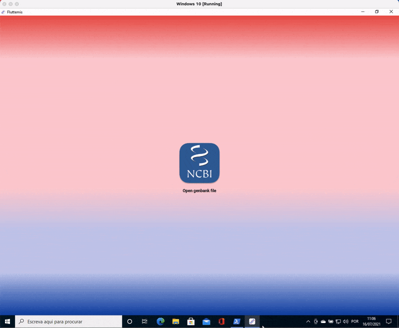
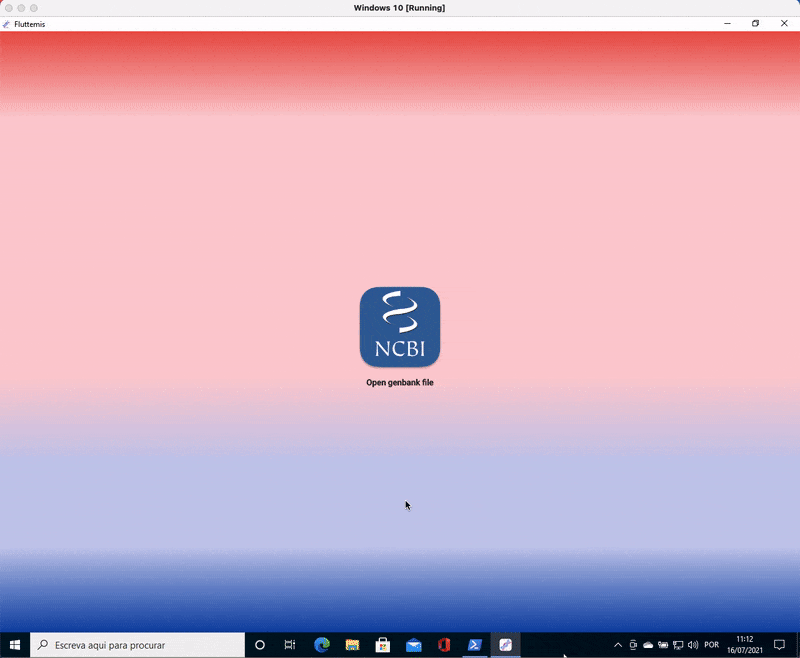

# Fluttemis

O Fluttemis é um software desktop, baseado no [Artemis](https://www.sanger.ac.uk/tool/artemis/) (a semelhança do nome não é mera coincidência), para a navegação gráfica de genomas de bactérias e visualização de seus dados de anotação.

## Tecnologias/bibliotecas

Algumas das tecnologias/bibliotecas utilizadas na construção do software foram:

 - Flutter toolkit 2.2.1 (stable) apenas desktop
 - Dart 2.13.1 (null safety)
 - Go 1.16.5
 - Hover 0.46.5
 - flutter_modular 3.2.2+1
 - file_picker: 3.0.3
 - flutter_bloc: 7.0.0
 - [bio-dart-package](https://github.com/oberdancunha/dart-bio-package)
 - dart_code_metrics: 3.2.3
 - mocktail 0.1.3

Além dessas, há também outras bibliotecas. O pubspec.yaml possui a lista completa das bibliotecas utilizadas.

## Go-flutter

Atualmente, o input de dados genômicos no fluttemis é realizado através de leitura de arquivo, mais especificamente [arquivo de anotação do genbank](https://widdowquinn.github.io/2018-03-06-ibioic/01-introduction/02-annotation.html).

Para isso, o melhor pacote encontrado para o flutter desktop foi o [file-picker](https://pub.dev/packages/file_picker). No entanto, o file-picker para o flutter desktop funciona somente através do [go-flutter](https://github.com/go-flutter-desktop/go-flutter).

Por isso, antes de mais nada, é necessário acessar a [documentação do file-picker](https://github.com/miguelpruivo/flutter_file_picker/wiki/Setup#desktop-go-flutter), na seção <b>Desktop (go-flutter)</b> e realizar a configuração do go-flutter (hover) de acordo com a documentação.

## O Software

### Leitura e visualização de um arquivo do genbank.

macOS Big Sur

Linux (Ubuntu 21.04 executado no VirtualBox)

Windows 10 (executado no VirtualBox)

### Troca e visualização de um outro arquivo do genbank.

macOS Big Sur

Linux (Ubuntu 21.04 executado no VirtualBox)

Windows 10 (executado no VirtualBox)

### Considerações

Em termos de performance, em comparação com o macOS, que é o sistema operacional nativo do computador, há uma sensível queda no linux e uma considerável queda no windows. No caso do linux é provável que o motivo seja o uso do VirtualBox. No caso do windows, cuja queda é mais acentuada, torna-se necessário um entendimento maior do(s) motivo(s) do que somente a pressuposição da máquina virtual.

Visualmente e em termos comportamentais, a comparação entre as três plataformas não apresentou distinção entre elas.

Sem dúvida alguma que uma comparação mais adequada em todos os aspectos seria com todas as plataformas rodando nativamente no computador. No entanto, mesmo usando uma máquina virtual para linux e windows, é perceptível que há uma homogeneidade entre as plataformas, mostrando que não é apenas no mobile que o flutter faz um belíssimo trabalho de cross-platform, mas no desktop também.

## Erros

O software pode apresentar os seguintes erros:

### Arquivo vazio

Caso o arquivo escolhido esteja vazio.

### Arquivo com formato incorreto

Caso o arquivo tenha dados, porém com o formato diferente do desejado, como o formato genbank, por exemplo.

### Arquivo não encontrado

Caso o arquivo escolhido, por algum motivo, desapareça antes mesmo de ser lido pelo software.

### Erro de leitura inesperado

Caso a leitura do arquivo apresente um erro inesperado e/ou desconhecido.

### Imagens dos erros e do ícone da aplicação

Icons made by <a href="https://www.freepik.com" title="Freepik">Freepik</a> from <a href="https://www.flaticon.com/" title="Flaticon">www.flaticon.com</a>

## Lista de tarefas

- Obter as sequências de nucleotideos das features. :heavy_check_mark:
- Criar um botão para copiar as sequências de nucleotídeos/aminoácidos da feature selecionada. :heavy_check_mark:
- Download de sequências no formato fasta de:
  1. Nucleotídeos dos locus
  2. Nucleotídeos de todas as features
  3. Aminoácidos de todas as features
  4. Nucleotídeos de uma feature de interesse 
  5. Aminoácidos de uma feature de interesse
- Busca (incluindo download no formato fasta) de uma lista de features, de acordo com:
  1. Produto
  2. Um intervalo dado pela posição inicial e final
  3. Nome de gene
- Implementar a leitura de dados de arquivos GFF 2/GTF e GFF 3.
- Mostrar os exons de genomas de eucariotos
- Refatoração constante